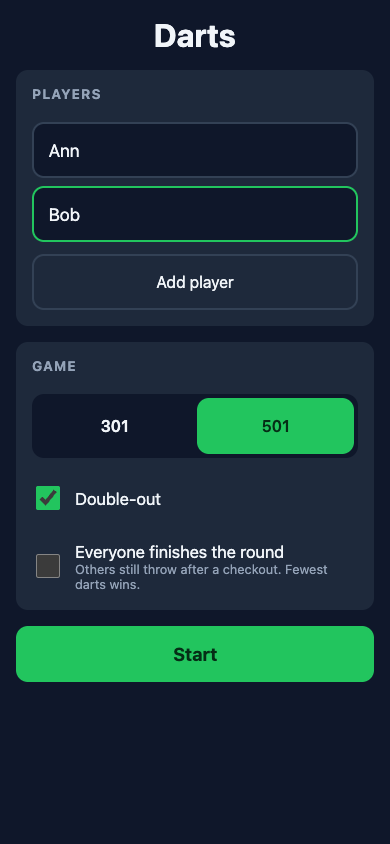
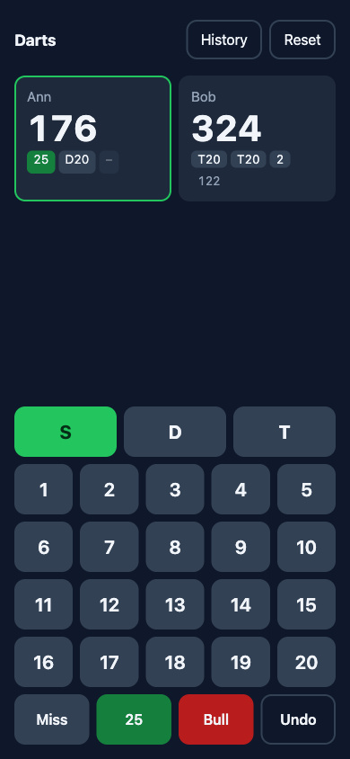
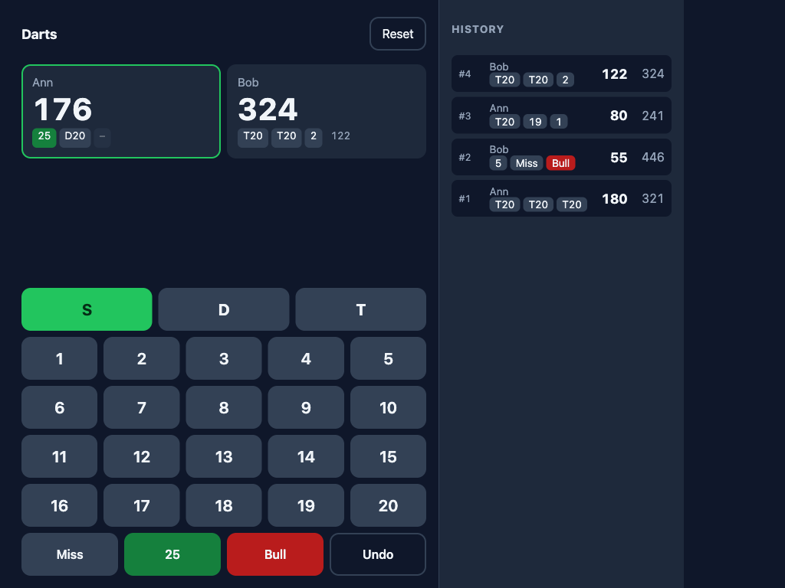
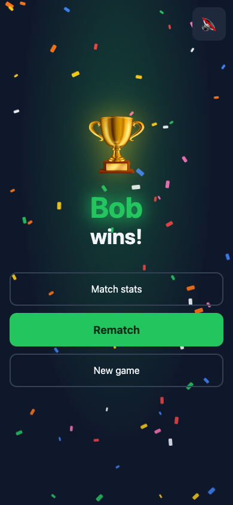
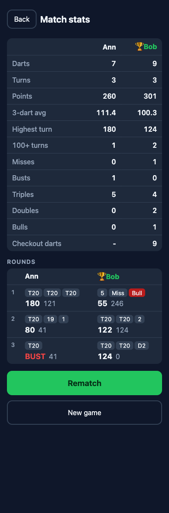

# Darts

A scoring app for x01 darts (301 / 501). Built to sit on a phone or tablet next to a real dartboard: big tap targets, dark theme, no account, no server.

## Features

- 2 or more players, any names
- 301 or 501 start score
- Double-out rule (on by default)
- Optional casual rule: everyone finishes the round after a checkout, fewest darts wins
- Per-dart input: Single / Double / Triple, 1-20, outer bull (25), bullseye (50), Miss
- Undo last dart, at any point
- Bust detection, turn totals, current player highlight
- Throw history: side panel on wide screens, slide-over on phones
- Game survives a page refresh (saved in localStorage)
- Winner celebration with confetti and a short fanfare (mutable)
- Match stats: 3-dart average, highest turn, misses, busts, triples, doubles, bulls, checkout darts, plus a round-by-round scoresheet

## Run locally

Requires Node.js 20 or newer.

```bash
npm install
npm run dev
```

Open the printed URL (default `http://localhost:5173`). To use it on a phone on the same network:

```bash
npm run dev -- --host
```

Then open the "Network" URL that Vite prints.

Other scripts:

```bash
npm test          # run the test suite once
npm run test:watch
npm run build     # type-check and build to dist/
npm run preview   # serve the production build
```

## How it works

### 1. Setup

Enter player names, pick 301 or 501, choose the rules, tap Start.



### 2. Play

The current player is highlighted. Pick a multiplier (S / D / T), then tap the number hit. The multiplier resets to Single after each dart. Use the green **25** for the outer bull and the red **Bull** for the bullseye. **Miss** records a dart that scored nothing. **Undo** removes the last dart, including across bust and turn boundaries.

Each card shows the remaining score, the darts of the current or last turn, the turn total, and **BUST** when a turn was voided.



On tablets and desktops the throw history is always visible on the right. On phones, tap **History** to open it.



**Reset** asks for confirmation, then returns to Setup with the same players and options prefilled.

### 3. Win

The game ends when a player reaches exactly zero. With double-out on, the final dart must be a double or the bullseye.



**Rematch** starts a new game with the same players and rules. **New game** returns to Setup. The speaker button mutes or unmutes the fanfare and remembers your choice.

### 4. Match stats

Per-player numbers and the full match as a scoresheet: one column per player, one row per round, showing the three darts, the turn total, and the remaining score.



## Rules implemented

| Rule | Behavior |
|---|---|
| Scoring | Segment × multiplier. Outer bull 25, bullseye 50 (counts as a double). |
| Turn | 3 darts, then the next player. |
| Bust | Going below zero, or with double-out on: landing on 1, or landing on 0 with a non-double. The turn scores nothing and the score is restored. |
| Win (official) | Exact zero ends the game immediately. Other players do not throw. |
| Win (finish the round) | Others still throw until the round ends. Fewest darts in the checkout turn wins. Equal darts is a draw. |
| Start order | Player 1 always throws first. |

## Project structure

```
src/
  engine/        Pure TypeScript, no React
    game.ts      deriveState(config, names, darts) -> GameState
    stats.ts     computeStats, groupRounds
    types.ts
  ui/            React components (Setup, Scoreboard, InputPad, History, Winner, Stats, ...)
  storage.ts     localStorage save / load of the in-progress game
  sound.ts       Web Audio fanfare and mute preference
  App.tsx        Screen state machine
  styles.css
```

The engine treats the ordered list of darts as the single source of truth. Every render replays the list to derive scores, turns, busts, and the winner. Undo is therefore just removing the last dart.

## Tech

Vite, React 19, TypeScript, Vitest, React Testing Library. Plain CSS, no UI library, no runtime dependencies beyond React.
